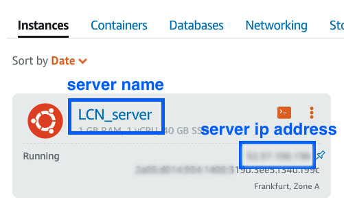

# Installing and configuring Caprover with Terraform

[CaptainRover](https://caprover.com/) is an extremely easy to use app/database deployment & web server manager for your NodeJS, Python, PHP, ASP.NET, Ruby, MySQL, MongoDB, Postgres, WordPress (and etc...) applications, and it's free!

This is a [Terraform](https://registry.terraform.io) project to automatically install and configure CaptainRover in an [AWS Lightsail](https://aws.amazon.com/lightsail/) server instance. If you want to learn how to use Terraform to configure your AWS Lightsail server check this [GitHub Repo](https://github.com/lcnstudenthousingporto/infrastructure_terraform).

## Setup

Inside our Terraform project, we will use [CapRover-cli](https://github.com/caprover/caprover-cli) commands to install and configure CaptainRover in your Server. To install CapRover-cli in your local machine open the Terminal and run:

```shell
npm install -g caprover
```

## Run

Now, let's make things work!

Before running the project you must add define some variables in [**config.json**](config.json) file. Below is our default content, the only value that you're required to define is your domain.

```json
{
    "server_name":"[SERVER_NAME]",
    "server_ip_address":"[SERVER_IP_ADDRESS]",
    "domain":"[YOUR_DOMAIN]",
    "email":"[YOUR_CAPROVER_CONTACT_EMAIL]"
}
```

Visit your AWS Lightsail dashboard and get the required Server details. For the domain, use same the same that is pointing to your Server and for the email just use the one you prefer.



Once you're configuration is ready, open the Terminal, enter your Terraform's directory, and type the following:

```shell
terraform init && 
terraform apply
```

First command initializes the project and downloads all provider dependencies, the second adds the specified resources.

## Small fix - *the 'www.' problem*

CapRover uses a [nginx](https://www.nginx.com/) server as gateway and, consequently, as a router, where each app **app_abc** is called via a url with the following format **[app_abc]**.*[your_cool_domain.com]*.

A problem arises when you use *www.* in your url, because *www.* is treated as part of your *app name*. To deal with this issue, CapRover allows us to add a custom rewrite rule to nginx. A rule to remove the *www.* part from the url before parsing and routing to your app. To do so, click the 'Edit Default Nginx Configuration' button in the HTTP Settings of your App (see next image), and add the rule presented below to the beginning of the configuration.


```javascript

server {
    listen 80;
    listen [::]:80;
    <%
    if (s.hasSsl) {
    %>
        listen              443 ssl http2;
        ssl_certificate     <%-s.crtPath%>;
        ssl_certificate_key <%-s.keyPath%>;
    <%
    }
    %>
    server_name www.blueresidence.pt;
    return 301 $scheme://blueresidence.pt;
}

```
